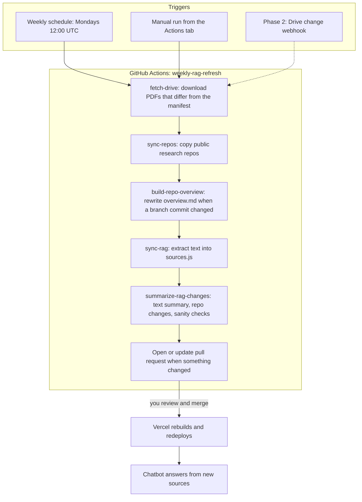

# Weekly RAG Refresh From Google Drive

## Goal

Keep the Digital Twin chatbot current without touching the repo by hand. You update your resume or LinkedIn export in one Google Drive folder, and within a week a pull request appears with the new source text and a plain-English summary of what changed. Merging it redeploys the chatbot.

## Why not scrape LinkedIn directly

The current monthly job fetches the public LinkedIn profile. Every run so far has been blocked (`HTTP 999`), and the job still reported success, so `linkedin.txt` has never been refreshed. Logging in with a headless browser would get past that, but:

- LinkedIn's User Agreement prohibits automated access, even to your own profile, and the risk is a restricted account.
- Logins from GitHub Actions servers trigger security checks (emailed codes, captchas, two-factor prompts), so the job would fail often.
- It would require storing your LinkedIn password or session cookie as a CI secret.

Instead, LinkedIn becomes a file you drop into Drive: on your profile, choose **More → Save to PDF**, and upload the result to the Drive folder. From then on, the resume and LinkedIn go through the same pipeline.

## Architecture

Research-repo snapshots are part of the same job. See [PLAN_REPO_AGENT.md](PLAN_REPO_AGENT.md) Step 4 and [data/repos/README.md](data/repos/README.md). A run with no Drive changes and no branch changes opens no pull request. A research-repo change still opens one.

The chatbot itself (`app/api/digital-twin/route.js`) does not change. It stays a read-only endpoint with no Google credentials. All fetching happens in the background job.

## Components

### Google Drive folder (the source of truth)

One folder shared with a Google service account as **Viewer**. The job picks files by name, and if several files match, it uses the most recently modified one:

| Source              | Matches                                                                             | Accepted formats                    | Written to                                 |
| ------------------- | ----------------------------------------------------------------------------------- | ----------------------------------- | ------------------------------------------ |
| Resume (required)   | name contains `resume`                                                              | PDF or Google Doc (exported to PDF) | `data/rag/resume.pdf`, `public/resume.pdf` |
| LinkedIn (optional) | name contains `linkedin`, or starts with `Profile` (LinkedIn's default export name) | PDF                                 | `data/rag/linkedin.pdf`                    |

`research-interests.md` stays in the repo and is still edited by hand.

### `scripts/fetch-drive-sources.mjs`

1. Signs in to Google as the service account, using a signed JWT and read-only Drive scope. This needs no extra npm packages.
2. Lists the folder and chooses the resume and LinkedIn files.
3. Compares each file's Drive ID, modified time, and checksum with `data/rag/drive-manifest.json`. If they match, the file is skipped. This matters for Google Docs, whose PDF exports differ byte-for-byte on every download and would otherwise open a pointless pull request every week.
4. Downloads changed files and checks that they are real PDFs before writing them.
5. Records the new file details in the manifest.

The script fails loudly (non-zero exit) if credentials are missing, the folder can't be read, or no resume is found. The old job's silent "success" is what hid the LinkedIn breakage for two months.

### `scripts/sync-rag-sources.mjs` (existing, small change)

Same as today, except that for LinkedIn it now prefers `linkedin.pdf` over `linkedin.txt`, since the PDF is what Drive provides. The old `linkedin.txt` (the scraper's output file) is removed.

### `scripts/summarize-rag-changes.mjs`

Writes the pull request description:

- **Changed files:** which Drive files were picked up, with their names and modified times.
- **What changed:** for each source whose extracted text differs, the old and new text go to `gpt-4o-mini`, which returns a short bullet list of factual changes, e.g. "Added AI Engineering Intern role at Hawl Technologies." If `OPENAI_API_KEY` isn't set or the call fails, this section says so and the job continues.
- **Repo changes:** for each research-repo branch whose commit changed, the old and new commit IDs and which snapshot files changed. Branches added or deleted are listed separately, along with whether `overview.md` was regenerated.
- **Sanity checks:** code-based warnings that don't depend on the AI, such as extracted text shrinking by more than 40% or being under 500 characters, both signs of a bad PDF export.

The "before" versions come from `git show HEAD:...`. The job never commits before the pull request step, so `HEAD` is still the version currently on `main`.

### `.github/workflows/weekly-rag-refresh.yml`

Replaces `monthly-linkedin-refresh.yml`.

- Triggers: a weekly schedule, manual `workflow_dispatch`, and `repository_dispatch` with type `drive-changed` (reserved for Phase 2).
- A `concurrency` group ensures overlapping triggers never run at the same time.
- After the Drive fetch, runs `npm run sync-repos` and `npm run build-repo-overview` (using the existing `OPENAI_API_KEY`), then `npm run sync-rag`. No new secrets are required while the research repos stay public.
- Uses `peter-evans/create-pull-request` on a fixed branch (`weekly-rag-refresh`) with the title "Update chatbot sources". If an earlier pull request is still open, it gets updated rather than duplicated. If nothing changed, no pull request is opened. A failure in the repo steps fails the job before this step.

### Human review stays in the loop

The pull request is never auto-merged. These files decide what the chatbot tells visitors about you, so a quick glance at the summary before merging is the safety net against a garbled PDF or the wrong file in the folder.

## One-time setup

1. **Google Cloud:** create a project (or reuse one), enable the **Google Drive API**, and create a **service account**. Under the service account's **Keys** tab, create a JSON key and download it.
2. **Drive:** create a folder (e.g. `Website Sources`), upload your resume and the LinkedIn "Save to PDF" file, and share the folder with the service account's email address (it ends in `iam.gserviceaccount.com`) as **Viewer**.
3. **GitHub:** under repository **Settings → Secrets and variables → Actions**, add these secrets:
   - `GOOGLE_SERVICE_ACCOUNT_JSON`: the full contents of the JSON key file.
   - `GOOGLE_DRIVE_FOLDER_ID`: the ID from the folder URL (`drive.google.com/drive/folders/<this part>`).
   - `OPENAI_API_KEY`: used for the change summary, and required when a research-repo branch changed so the overview can be rewritten.
4. Run the workflow once by hand from the **Actions** tab to confirm it works.

Local testing uses the same variables in `.env` (already gitignored), then `npm run fetch-drive`, `npm run sync-repos`, `npm run build-repo-overview`, and `npm run sync-rag`.

## Phase 2 (later): react to Drive changes within minutes

The weekly schedule already covers the main need. For near-instant updates:

1. Add `app/api/drive-webhook/route.js`. Google calls it when anything in the service account's view of Drive changes. It checks a shared secret token in the `X-Goog-Channel-Token` header, then calls GitHub's `repository_dispatch` API with `event_type: drive-changed`, which starts the same workflow.
2. Subscribe with the Drive `changes.watch` API. Subscriptions expire after at most about a week, so a small scheduled job has to renew them.
3. New secrets: a fine-grained GitHub token that can trigger workflows, stored in Vercel, plus the webhook token.

The workflow already listens for `drive-changed`, so Phase 2 adds only the webhook and the renewal job. The existing pipeline stays as it is.

## What gets removed

- `scripts/refresh-linkedin.mjs` and its `refresh-linkedin` npm script
- `.github/workflows/monthly-linkedin-refresh.yml`
- `data/rag/linkedin.txt`

## Testing

- Unit tests (Vitest) cover: file selection from a Drive listing, detecting changes against the manifest, JWT signing (checked against a generated key), Drive download and export requests (with a mocked `fetch`), parsing `sources.js`, the sanity-check warnings, and pull request body output with and without an AI summary.
- `npm run sync-rag` confirms that switching LinkedIn to the PDF produces essentially the same text as the old `linkedin.txt`.
- End-to-end: after setup, trigger the workflow manually and confirm it either opens a pull request or reports "no changes."
