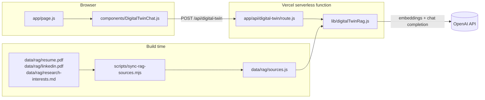
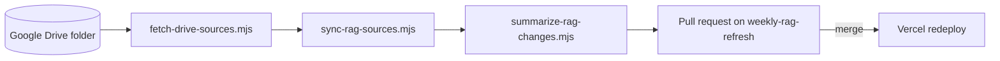

# Architecture

The site is one Next.js App Router page plus one API route. Everything the chatbot knows is baked into the deployment at build time. There is no database and no runtime access to Google Drive.

## Front end

- `app/layout.js` loads the Inter (sans) and Newsreader (serif) fonts as CSS variables, sets page metadata, and renders a skip-to-content link.
- `app/page.js` is a client component that assembles the page from `SiteHeader`, `HeroSection`, inline sections for status and areas of inquiry, lists rendered from `data/readingArchive.js` and `data/projects.js`, and `DigitalTwinChat`.
- **Scroll-reactive background:** `hooks/useScrollProgress.js` returns scroll position as a number from 0 to 1, updated at most once per animation frame. `app/page.js` turns that into a layered gradient that darkens toward black as you scroll, and sets the `--mesh-opacity` and `--grain-opacity` CSS variables used by overlay layers in `app/globals.css`.
- `components/SiteHeader.js` has a collapsible mobile menu. Its nav links point to section IDs on the page (`#inquiry`, `#reading`, `#projects`, `#digital-twin`), `/resume.pdf`, and a `mailto:` link.

## Chat request lifecycle

1. `DigitalTwinChat` keeps the conversation in React state. On submit it sends `{ message, history }` to `/api/digital-twin`, where `history` is every message after the greeting, including the new question.
2. `route.js` runs these checks in order, returning early on failure:
   1. **Origin check:** if an `Origin` header is present, its host must match the request host (`x-forwarded-host` or `host`). Requests with no `Origin` header, such as `curl`, are allowed.
   2. **Rate limit:** 5 requests per 60 seconds per client IP (`lib/rateLimiter.js`, settings in `lib/digitalTwinConfig.js`). Skipped when `DISABLE_RATE_LIMIT=1` and `NODE_ENV` is not `production`, which is how `npm run eval-twin` runs against `npm run dev`. `next start` and Vercel always set `NODE_ENV=production`, so the bypass cannot apply there.
   3. **Validation:** the message must be non-empty after trimming and at most 1,000 characters.
3. `answerCareerQuestion` in `lib/digitalTwinRag.js` builds or reuses the index, retrieves context, and calls the chat model.
4. The route logs one structured analytics event per request (`lib/digitalTwinAnalytics.js`) and returns `{ answer, sources }`.

The full contract is in [digital-twin-api.md](digital-twin-api.md).

## RAG pipeline

### Source generation (build time)

`scripts/sync-rag-sources.mjs` reads the files in `data/rag/`, extracts text from PDFs with `pdf-parse`, cleans whitespace and page markers, and writes `data/rag/sources.js` as an array of `{ label, content }` objects.

| Label              | Preferred input         | Fallback       | Required |
| ------------------ | ----------------------- | -------------- | -------- |
| Resume             | `resume.pdf`            | `resume.txt`   | Yes      |
| LinkedIn           | `linkedin.pdf`          | `linkedin.txt` | No       |
| Research Interests | `research-interests.md` | none           | Yes      |

The script fails if a required source is empty. PDF parsing happens only here, never at request time, which keeps `pdf-parse` out of the serverless function.

### Indexing (first request per instance)

On the first chat request, each serverless instance:

1. Splits every source into chunks of about 900 characters with 160 characters of overlap. Chunk boundaries snap to the nearest sentence end or whitespace, and chunks of 60 characters or fewer are dropped.
2. Embeds all chunks with `text-embedding-3-small`, in batches of 40.
3. Caches the resulting array in module memory (`cachedIndexPromise`).

The cache lasts as long as the warm instance. Each cold start re-embeds all sources, which costs one embeddings call per 40 chunks. Changing sources requires a redeploy.

### Retrieval and generation (every request)

1. Embed the question.
2. Rank all chunks by cosine similarity and keep the top 6.
3. Build the prompt: a system message restricting answers to the provided context, the last 8 valid history messages (with the current question removed if it's the last entry), and a final user message containing the question and the retrieved chunks labeled by source.
4. Call `gpt-4o-mini` with temperature 0.2.
5. Return the answer and the unique source labels of the retrieved chunks.

## Keeping sources current

A weekly GitHub Action fetches updated PDFs from a Google Drive folder, regenerates `sources.js`, writes an AI summary of what changed, and opens a pull request. Merging the pull request triggers a Vercel redeploy. See [deployment.md](deployment.md) and [PLAN.md](../PLAN.md).

## Known limitations

- The rate limiter and embedding cache live in memory per instance, so limits are approximate when Vercel runs several instances.
- The retrieval index is recomputed on every cold start instead of being persisted.
- Sources are labeled by document only (for example "Resume"), not by passage.
