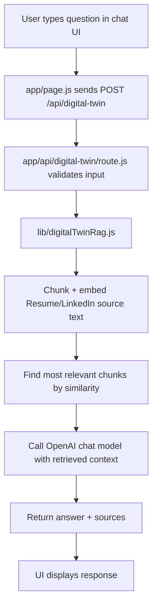

# Beginner Tutorial: How This Portfolio + Digital Twin Works

This tutorial explains what was built in your project, why each part exists, and how everything connects end-to-end.

It is written for a complete beginner, so if some terms are new (like "API route" or "RAG"), do not worry. We will define them as we go.

---

## 1) What You Have Built

You now have a modern portfolio website with:

1. A **Next.js frontend** (React-based UI).
2. A dark "Enterprise meets Edgy" design with a **scroll-reactive background**.
3. A "Digital Twin" chat panel that answers questions about your career.
4. A **server-side API** that calls OpenAI securely (your API key is never exposed to the browser).
5. A lightweight **RAG pipeline** (Retrieval-Augmented Generation) using resume + LinkedIn content.
6. Deployment on **Vercel** (instead of GitHub Pages, because this app needs server-side API support).

---

## 2) Technology Summary

### Core stack

- **Next.js**: Full-stack React framework (frontend + backend API in one project)
- **React**: UI components and state management
- **CSS (custom)**: Styling and layout
- **OpenAI Node SDK**: Embeddings + chat completions
- **Vercel**: Hosting platform for Next.js apps

### Why this stack?

- GitHub Pages is great for static sites, but your Digital Twin needs server logic.
- Next.js lets you keep everything in one codebase:
  - `app/page.js` for UI
  - `app/api/...` for backend logic

---

## 3) Project Structure (Important Files)

```text
personal-website/
  app/
    api/
      digital-twin/
        route.js          # Backend endpoint for chat
    globals.css           # Global styling
    layout.js             # Root HTML layout and fonts
    page.js               # Main page UI + chat interaction
  assets/
    profile.png
  data/
    rag/
      sources.js          # Embedded resume + LinkedIn text content
  lib/
    digitalTwinRag.js     # Retrieval + OpenAI answer generation
  next.config.mjs
  package.json
```

---

## 4) High-Level Architecture



Simple translation:

- The browser only handles the user experience.
- The server does the secure AI work.
- RAG helps the model answer with your real career details.

---

## 5) Walkthrough of What Was Done

## Step A: Move from static HTML to Next.js

A static `index.html` was replaced by a Next.js app structure.  
This gives you reusable React components, server routes, and clean deployment.

Key scripts:

```json
{
  "scripts": {
    "dev": "next dev",
    "build": "next build",
    "start": "next start"
  }
}
```

---

## Step B: Add global layout and fonts

`app/layout.js` defines global metadata and font variables:

```js
import { Inter, Newsreader } from "next/font/google";
import "./globals.css";

export const metadata = {
  title: "Sachin Ganpule | Research Archive",
  description: "Master of Applied Data Science at University of Michigan...",
};
```

Why this matters:

- Sets page title/description for SEO.
- Keeps typography consistent across the full app.

---

## Step C: Build the main page UI in React

`app/page.js` contains:

- Portfolio sections (hero, inquiry, reading, projects)
- Dynamic scroll-based background logic
- Digital Twin chat state and form submission

Example state setup:

```js
const [messages, setMessages] = useState([INITIAL_TWIN_MESSAGE]);
const [questionInput, setQuestionInput] = useState("");
const [isAsking, setIsAsking] = useState(false);
const [chatError, setChatError] = useState("");
```

---

## Step D: Add "Enterprise meets Edgy" visual style

The design is powered by custom CSS in `app/globals.css`:

- Deep dark palette
- Frosted sticky header
- Layered gradients
- Subtle mesh and grain overlays
- Responsive layout

Example background layer setup:

```css
.site-shell::before {
  background:
    repeating-linear-gradient(...),
    repeating-linear-gradient(...);
  opacity: var(--mesh-opacity, 0.12);
}
```

---

## Step E: Add scroll-reactive background darkening

In `app/page.js`, scroll progress is measured and used to generate gradient values:

```js
const progress = Math.min(1, Math.max(0, window.scrollY / pageHeight));
setScrollProgress(progress);
```

Then color intensity is computed in `useMemo`, and applied inline:

```js
<div className="site-shell" style={backgroundStyle}>
```

This creates a smooth transition toward black as users scroll down.

---

## Step F: Build the Digital Twin chat UI

The chat panel includes:

- Message list
- Loading state (`Thinking...`)
- Textarea input
- Submit button
- Error display
- Source badges (`Resume`, `LinkedIn`)

Request from frontend:

```js
const response = await fetch("/api/digital-twin", {
  method: "POST",
  headers: { "Content-Type": "application/json" },
  body: JSON.stringify({ message: question, history }),
});
```

---

## Step G: Create backend API route

`app/api/digital-twin/route.js` handles POST requests:

```js
export async function POST(request) {
  const payload = await request.json();
  const message = typeof payload?.message === "string" ? payload.message : "";
  ...
  const result = await answerCareerQuestion({ question: message, history });
  return NextResponse.json(result);
}
```

Why this matters:

- Keeps secret API key on server only.
- Central place for validation and error handling.

---

## Step H: Implement RAG in `lib/digitalTwinRag.js`

RAG means:

1. Retrieve relevant source text chunks.
2. Augment model prompt with those chunks.
3. Generate answer grounded in that context.

Important pieces:

### 1. Chunking

```js
const MAX_CHUNK_LENGTH = 900;
const CHUNK_OVERLAP = 160;
```

This splits large source text into manageable overlapping blocks.

### 2. Embeddings

```js
const EMBEDDING_MODEL = "text-embedding-3-small";
const response = await client.embeddings.create({ model: EMBEDDING_MODEL, input: texts });
```

Embeddings convert text into numeric vectors.

### 3. Similarity search

```js
const ranked = index
  .map((chunk) => ({ ...chunk, score: cosineSimilarity(queryEmbedding, chunk.embedding) }))
  .sort((a, b) => b.score - a.score)
  .slice(0, TOP_K);
```

This picks the most relevant chunks for the user question.

### 4. Grounded answer generation

```js
const completion = await client.chat.completions.create({
  model: "gpt-4o-mini",
  temperature: 0.2,
  messages,
});
```

Low temperature helps keep answers focused and less random.

---

## Step I: Source content strategy

Instead of parsing PDFs at request-time in production, the source text is embedded in:

- `data/rag/sources.js`

This avoids runtime PDF parsing issues in serverless environments and makes deployment stable.

---

## Step J: Deploy to Vercel

Because the app has a backend API route, deployment moved to Vercel.

`next.config.mjs` is now standard (no static export mode):

```js
const nextConfig = {};
export default nextConfig;
```

Your site is deployed and live on Vercel.

---

## 6) How to Run Locally (Beginner checklist)

From project root:

```bash
npm install
npm run dev
```

Then open:

- `http://localhost:3000`

Make sure `.env` has:

```bash
OPENAI_API_KEY=your_key_here
```

---

## 7) How to Deploy New Changes

Since repo is linked to Vercel, you have two options:

### Option 1 (recommended): Push to `main`

```bash
git add .
git commit -m "Your message"
git push origin main
```

Vercel auto-deploys.

### Option 2: Manual production deploy

```bash
npx vercel --prod
```

---

## 8) Detailed Code Review (Beginner Notes)

### `app/layout.js`

- Sets global page metadata and fonts.
- Wraps all app pages with one `<html>`/`<body>`.
- Good practice: keep global app concerns here.

### `app/page.js`

- Main portfolio UI and logic.
- Uses React hooks (`useState`, `useEffect`, `useMemo`).
- Holds chat interaction logic and API call.
- Good pattern: keep "UI event -> fetch -> update state" in one handler.

### `app/globals.css`

- Defines design system and responsive behavior.
- Uses semantic class names (`hero-grid`, `twin-panel`, `chat-log`).
- Adds subtle visual depth with overlays and gradients.

### `app/api/digital-twin/route.js`

- Minimal and clean request handler.
- Validates message content before processing.
- Returns structured JSON and useful errors.

### `lib/digitalTwinRag.js`

- Encapsulates all retrieval + generation logic.
- Caches built index in memory for better performance after first request.
- Good separation: API route stays thin, heavy logic is in a library.

### `data/rag/sources.js`

- Stores source text for Resume and LinkedIn.
- Keeps the chatbot grounded in your own career data.

---

## 9) How to Update Digital Twin Knowledge

RAG source data is now generated from stable source files instead of being edited by hand.

Resume workflow:

1. Replace `data/rag/resume.pdf` with the newest resume.
2. Replace `public/resume.pdf` with the same file so the site download link stays current.
3. Optionally run `npm run sync-rag` locally to inspect generated text.
4. Commit and push.
5. Vercel runs `npm run build`, and `prebuild` automatically runs `npm run sync-rag`.

Research-interest workflow:

1. Edit `data/rag/research-interests.md`.
2. Run `npm run sync-rag`.
3. Commit and push.

LinkedIn workflow:

- The site keeps LinkedIn as a RAG source through `data/rag/linkedin.txt`.
- A monthly GitHub Actions workflow attempts to refresh it from the public LinkedIn profile and opens a pull request if anything changes.
- If LinkedIn blocks unauthenticated access, the workflow keeps the existing LinkedIn source unchanged.

---

## 10) Self-Review: 5 Improvements To Make Next

1. **Move RAG preprocessing to a build script**  
   Automate extraction/chunk preparation so `data/rag/sources.js` is generated from PDFs with one command.

2. **Add persistent vector storage**  
   Current in-memory index works, but a small vector DB (or persisted JSON embeddings) would improve scalability and cold-start behavior.

3. **Improve conversation memory quality**  
   Add smarter chat history management (summarization + token budgeting) instead of only sending the last few turns.

4. **Add analytics and observability**  
   Track chat usage, latency, and error rates to understand real-world behavior and improve reliability.

5. **Strengthen source attribution UI**  
   Show exact citation snippets (not only source labels) so users can see *why* the answer was produced.

---

## Final Notes

You now have a strong portfolio foundation:

- polished frontend,
- live server-backed AI feature,
- production deployment pipeline.

The architecture is solid for a personal brand site and can evolve into a larger AI product with incremental upgrades.
